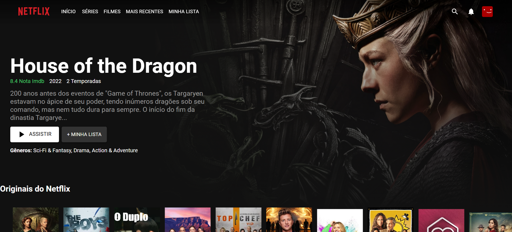

<p align="center">
  
</p>

<h3 align = "center" fontSize="60px">
  Replica clone da interface UI da plataforma de streaming <a href="https://www.netflix.com/">Netflix</a>
</h3>

<p align="center">
  
</p>

<p align="center">
  
</p>

# Clone Netflix UI

Desenvolvimento de um projeto de front-end utilizando HTML, CSS e JavaScript com a biblioteca React.js para replicar a interface do [Netflix](https://www.netflix.com/). Utilizei a [API TMDb](https://www.themoviedb.org/documentation/api) para obter todas as informações necessárias dos filmes, como título, descrição, capas, imagens de fundo e avaliações.


# Veja o Projeto ou siga os passos abaixo

https://sub-dev.github.io/clone-netflix-ui

## 🛠️ Construído com

# Tecnologias Utilizadas :

-  [React.js](https://pt-br.reactjs.org/)
-  [Material-UI](https://mui.com/material-ui/)

## 🚀 Começando

Faça um clone desse repositório e acesse o diretório.

```bash
$ git clone git@github.com:LeeonardoVargas/netflix-clone.git && cd netflix-clone
```

Para ter acesso a API você precisará de uma chave, basta criar uma conta no TMDB para ter acesso, [TMDB](https://www.themoviedb.org/). Caminho da chave: **Perfil -> Configurações -> API -> Chave da API**

Renomeie o arquivo `.env.example` para `.env` e cole o valor da sua chave no campo **REACT_APP_API_KEY**. Agora instale as dependências e execute o projeto:

```bash
# Instalando as dependências
$ npm install

# Executanto aplicação
$ npm start
```
Executa o aplicativo no modo de desenvolvimento.\
Abra [http://localhost:3000](http://localhost:3000) para visualizá-lo em seu navegador.

A página será recarregada quando você fizer alterações.\
Você também pode ver erros de lint no console.
